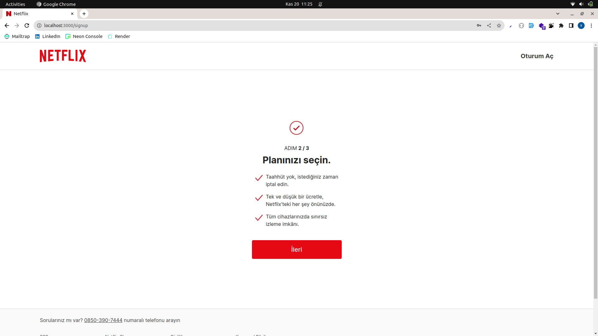
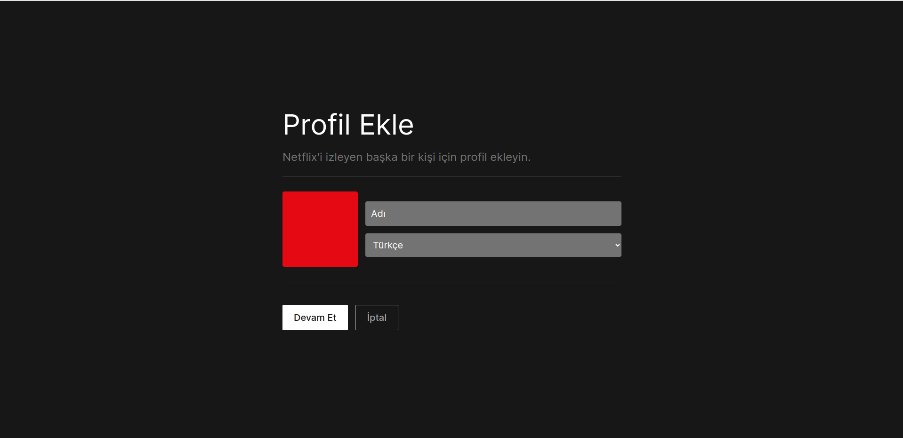
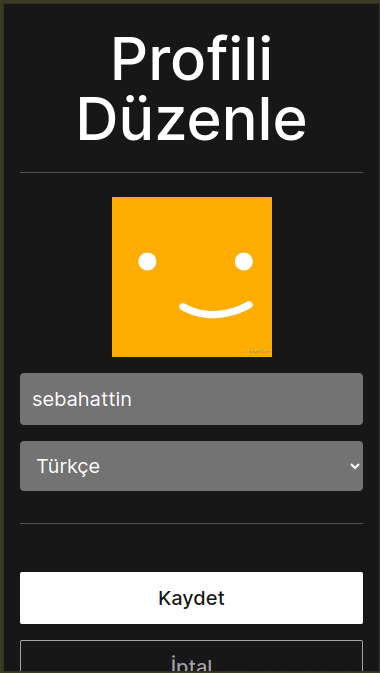

# Netflix Clone

## Project Description
In this project, Next.js and TMDB API used. The project contains most of the features of Netflix such as registration, profile management, movie/serie sections, search functionality, my list page.

## Gift Option Code
12345678910

## Features
- Sign up
- Login
- Profile management
- Popular movies
- Movie sliders by genre
- Latest movies
- Popular series
- Serie sliders by genre
- Latest series
- Movie/serie detail popup
- Movie/serie search
- Add movie/serie to list
- Remove movie/serie from list
- Responsive Design

## Packages Used
- Redux Toolkit
- React Query
- Prisma
- React Hook Form
- Zod
- Swiper
- React Loading Skeleton
- React Icons
- Axios

## Installation Guide
- clone the project &nbsp; `git clone https://github.com/Scholak/netflix-clone.git`
- install dependencies &nbsp; `npm install` &nbsp; or &nbsp; `yarn install` 
- create `.env` file and paste `.env.example` file content
- create `.env.local` file and paste `.env.local.example` file content
- define environment variables
- run `yarn dev` &nbsp; or &nbsp; `npm run dev`
- visit http://localhost:3000

## Live Demo
https://netflix-clone-one-beryl.vercel.app

## Project Images

 
 

 
 

 
 

 
 

 
 

 
 

 
 

 
 

 
 

 
 

 
 

 
 

 
 

 
 

 
 

 
 

 
 

 
 

 
 

 
 

 
 
